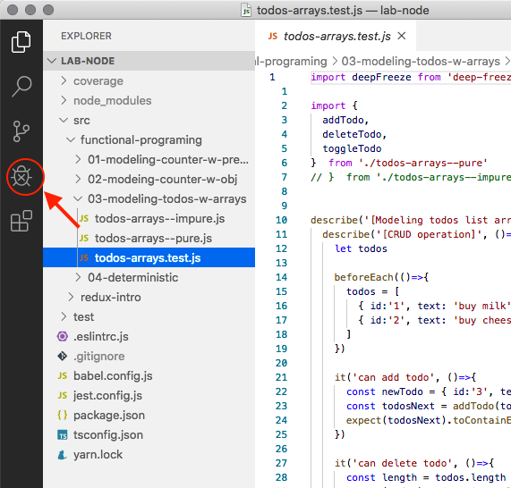
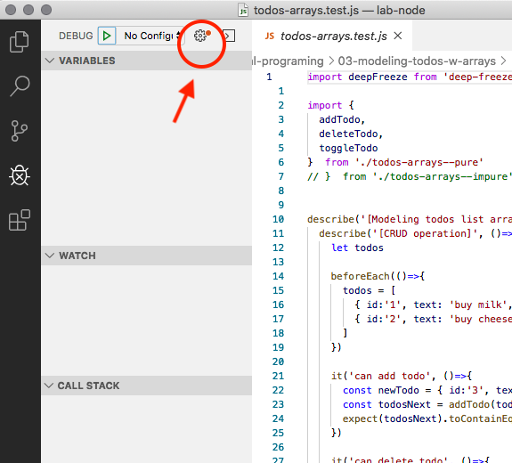
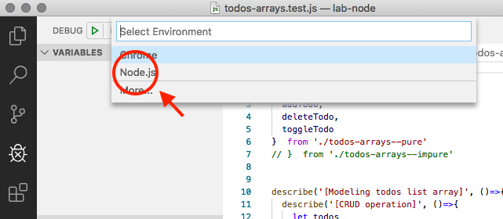
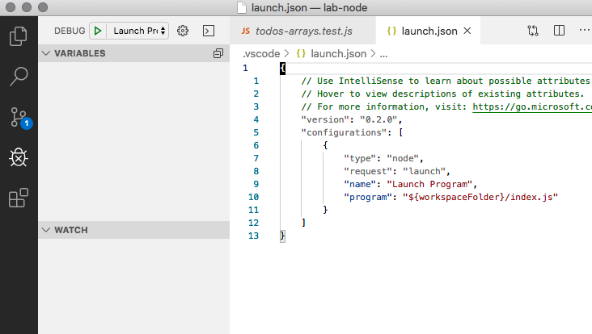
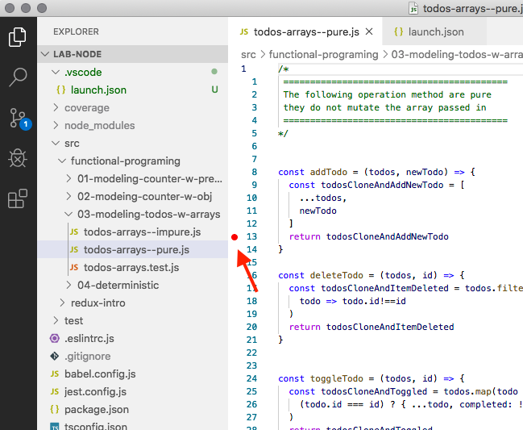
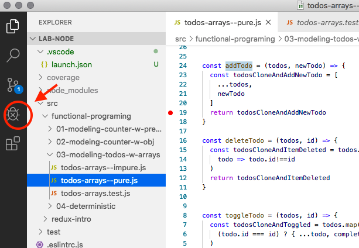
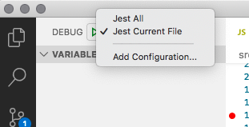
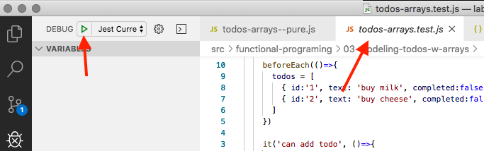
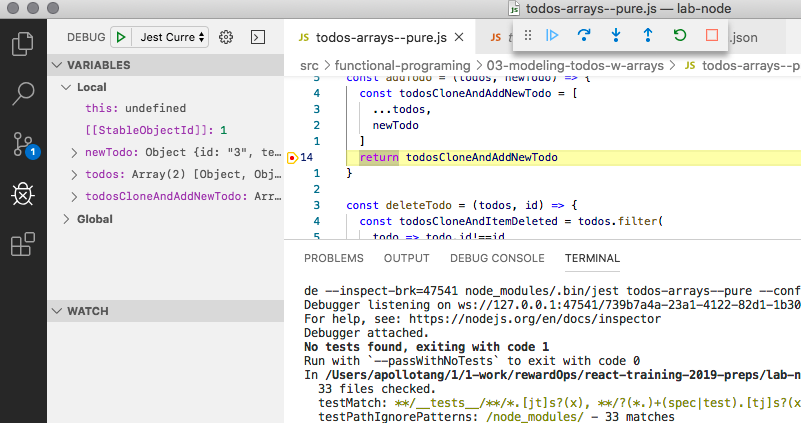

## Debugging jest test

This instructions are taken from [https://github.com/microsoft/vscode-recipes/tree/master/debugging-jest-tests](https://github.com/microsoft/vscode-recipes/tree/master/debugging-jest-tests)

### configuration

Click on the Debugging icon in the Activity Bar to bring up the Debug view:



Then click on the gear icon to configure a launch.json file:



selecting Node for the environment:





Replace content of the generated launch.json with the following configurations:

```
{
  "version": "0.2.0",
  "configurations": [
    {
      "type": "node",
      "request": "launch",
      "name": "Jest All",
      "program": "${workspaceFolder}/node_modules/.bin/jest",
      "args": ["--runInBand"],
      "console": "integratedTerminal",
      "internalConsoleOptions": "neverOpen",
      "disableOptimisticBPs": true,
      "windows": {
        "program": "${workspaceFolder}/node_modules/jest/bin/jest",
      }
    },
    {
      "type": "node",
      "request": "launch",
      "name": "Jest Current File",
      "program": "${workspaceFolder}/node_modules/.bin/jest",
      "args": [
        "${fileBasenameNoExtension}",
        "--config",
        "jest.config.js"
      ],
      "console": "integratedTerminal",
      "internalConsoleOptions": "neverOpen",
      "disableOptimisticBPs": true,
      "windows": {
        "program": "${workspaceFolder}/node_modules/jest/bin/jest",
      }
    }
  ]
}
```


### Step to debug:

Set a breakpoint in a test file:



Go to the Debug view:



Select "Jest All" or "Jest Current File" in dropdown:



Click your test file, and press F5 or click the green play button:



Your breakpoint will now be hit:




